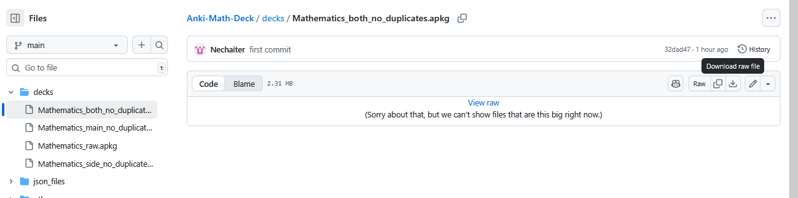

# Anki Mathematics Decks

Welcome! Here you can download several versions of the Mathematics deck for Anki. The decks are available in the `decks/` folder:

- **Mathematics_raw.apkg**: The original deck published on [AnkiWeb](https://ankiweb.net/shared/info/779157721). No duplicates removed.
- **Mathematics_both_no_duplicates.apkg**: Duplicates removed from both main and side courses.
- **Mathematics_main_no_duplicates.apkg**: Duplicates removed only from the main course.
- **Mathematics_side_no_duplicates.apkg**: Duplicates removed only from the side course.

## How to Import a Deck into Anki

1. Download the `.apkg` file you want from the `decks/` folder.
2. Open Anki.
3. Go to `File` > `Import...` and select the downloaded deck file.
4. The deck will appear in your Anki collection.

## About Duplicates

When using Anki's "Find Duplicates" feature, you may see cards flagged as duplicates by name. Most of these are actually different cards with the same name, but a few are true duplicates (same name and content) that the script did not filter out. Sorry for this inconvenience, there are only a few, and you can easily review them using Anki's `duplicates` tag.
